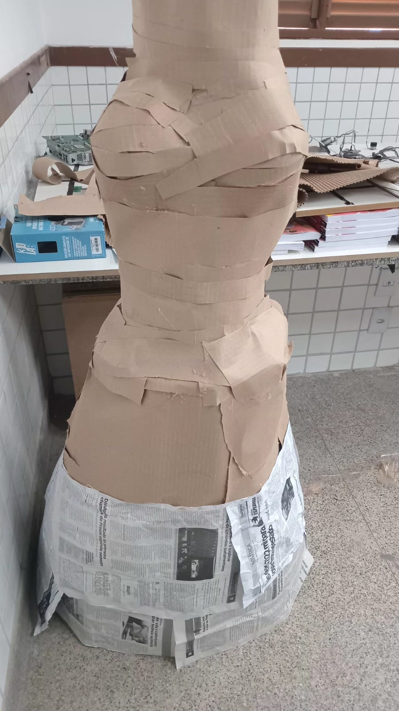
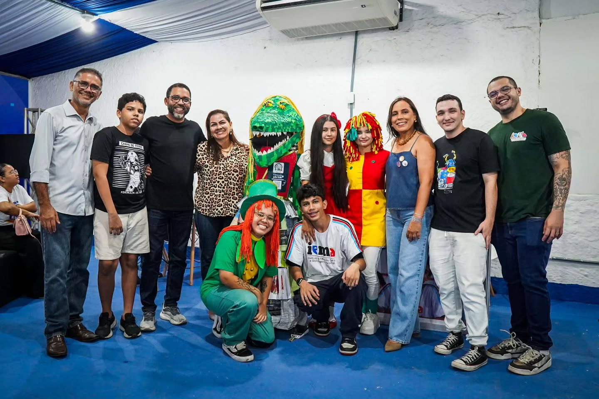

# 🤖 Cuca Bot - Dual ESP32 Interactive System

Projeto robótico interativo baseado em uma arquitetura Mestre-Escravo com dois microcontroladores **ESP32**, utilizando comunicação serial UART, detecção de cor por sensor óptico, controle de motor de passo e transmissão de áudio via Bluetooth A2DP.

---

## 📌 Arquitetura do Sistema

O sistema é dividido em dois blocos de processamento independentes para garantir alta performance e evitar atrasos na reprodução de áudio:

- **ESP32 Mestre:**
  - Leitura do sensor de cor (TCS230 / TCS320) ou sensor ultrassónico (dependendo da versão).
  - Controle do motor de passo (28BYJ-48 com driver ULN2003).
  - Envio de comandos de sincronização via UART2 (`TOCAR:X`).
  - Gestão de atualizações remotas via Wi-Fi (ArduinoOTA).

- **ESP32 Escravo:**
  - Recepção de comandos via UART2.
  - Leitura do buffer de áudio na memória Flash (PROGMEM).
  - Streaming de áudio estéreo em tempo real via Bluetooth A2DP para caixas de som externas.
  - Envio de sinal de conclusão (`FIM`) para o Mestre.

---

## 🔌 Pinagem e Conexões

### 1. ESP32 Mestre
- **Sensor de Cor TCS230/320:**
  - `S0` -> GPIO 25
  - `S1` -> GPIO 26
  - `S2` -> GPIO 27
  - `S3` -> GPIO 14
  - `OUT` -> GPIO 35
- **Driver de Motor ULN2003:**
  - `IN1` -> GPIO 13
  - `IN2` -> GPIO 4
  - `IN3` -> GPIO 12
  - `IN4` -> GPIO 5

### 2. Comunicação UART (Entre ESP32 Mestre e Escravo)

| ESP32 Mestre | Direção | ESP32 Escravo |
| :--- | :---: | :--- |
| **GPIO 17 (TX2)** | $\rightarrow$ | **GPIO 16 (RX2)** |
| **GPIO 16 (RX2)** | $\leftarrow$ | **GPIO 17 (TX2)** |
| **GND** | $\leftrightarrow$ | **GND** |

---

## 🛠️ Requisitos de Hardware e Alimentação

1. **Alimentação:**
   - Recomenda-se utilizar uma fonte externa de **5V / 2A** para alimentar o driver do motor de passo e o ESP32 Escravo.
   - Adicionar um capacitor eletrolítico (470µF a 1000µF) nos pinos de alimentação do ESP32 Escravo para mitigar picos de consumo do rádio Bluetooth e evitar *brownouts*.

2. **Dispositivo de Áudio:**
   - O firmware é compatível com caixas de som Bluetooth padrão (A2DP Sink).

---

## 💻 Bibliotecas Utilizadas

- [ESP32-A2DP](https://github.com/pschatzmann/ESP32-A2DP) (A2DP Source para transmissão de áudio)
- `Stepper` (Controle de motores de passo)
- `ArduinoOTA` / `WiFi` (Atualização de firmware via rede)

---

## 📖 Nossa Trajetória com a Cuca

O projeto **Cuca Bot** nasceu da nossa união entre eletrónica, programação e cultura popular. Ao longo do tempo, o robô passou por várias fases de desenvolvimento, testes e grandes conquistas!

### 🛠️ 1. O Processo de Desenvolvimento e Montagem
Tudo começou na bancada de testes, soldando os componentes, ajustando a eletrónica e estruturando a carcaça do robô até o sistema dual ESP32 começar a ganhar forma[cite: 2].

  
  

### 🥉 2. Conquista na Olimpíada Brasileira de Robótica (OBR)
Levamos a Cuca para competir na OBR e o nosso esforço foi recompensado: conquistamos um fantástico **3º lugar**, provando a eficiência da nossa lógica e construção robótica[cite: 2]!
> .jpeg)[cite: 2]
> .jpeg)[cite: 2]

### 🎪 3. Destaque e Abertura na Expoema (Estande do IEMA)
Graças ao sucesso do projeto, fomos convidados especiais para participar da **abertura da Expoema no estande do IEMA**, onde a Cuca interagiu com o público e representou com muito orgulho o nosso trabalho[cite: 2].
> [cite: 2]

---

## 👥 Autores

Desenvolvido por:

- **[Ana Beatriz]** - [@anabeatriz26920](https://github.com/anabeatriz26920)
- **[Mosaniel]** - [@mosanielbr-hub](https://github.com/mosanielbr-hub)

---

## 📄 Licença

Este projeto está licenciado sob a Licença MIT - consulte o arquivo [LICENSE](LICENSE) para mais detalhes.
